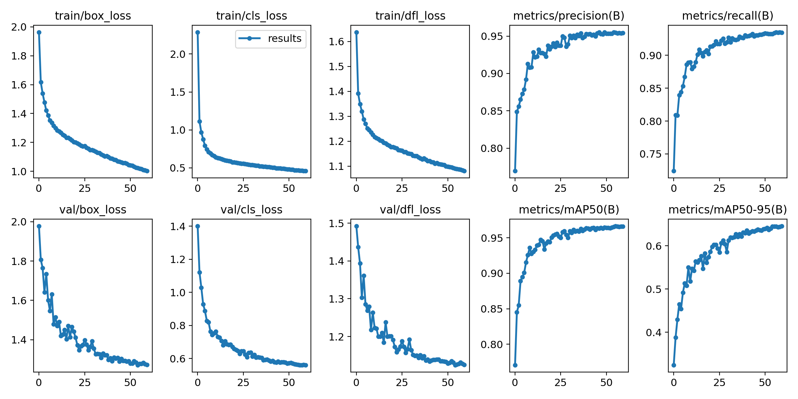

# Face parts detection with YOLOv8 🎯

## Introduction

In this project I use the most recent implementation of YOLO by Ultralytics, [YOLOv8](https://github.com/ultralytics/ultralytics). The goal is to train an algorithm that is able to detect separate face parts without having to use landmark detectors that don't do well when part of the face is occluded or missing. My goal is to also combine frontal, semi-frontal and profile face datasets so that the YOLO model works well on all of them. 

It is also a great opportunity to try out the `supervision` library by [Roboflow](https://github.com/roboflow/supervision). Despite it's still in beta, it looks really helpful for some common YOLO-related tasks such as drawing the detections.

## Motivation

All I want these models for is data exploration and check what face parts can be seen in an image. Note that I'm talking about detecting _face parts_, which is not the same as detecting _faces_. I've been asked many times: why not using facial landmark detectors? And the reason is that these do not work well with close-up images, like this one:

I know there are several works about facial landmark detection for occluded faces (such as ["Robust face landmark estimation under occlusion"](https://pdollar.github.io/files/papers/BurgosArtizzuICCV13rcpr.pdf)), but a picture of the entire face is always needed. If I wanted to be able to detect face parts in close-up images, I would have to develop something new. And that's what I've done.

## Data

For this experiment I'm using a variety of facial landmark detection datasets. Each dataset came in a different structure, so I had to deal with that in `prepare_data.py`:

- Existing datasets: all these datasets were processed by converting each group of facial landmarks (eye, mouth, nose, eyebrows) to a bounding box compatible with YOLO.
  - [Helen dataset](http://www.ifp.illinois.edu/~vuongle2/helen/)
  - [Menpo2D dataset](https://github.com/jiankangdeng/MenpoBenchmark)
  - [AFW (Annotated Faces in the Wild) dataset](https://ibug.doc.ic.ac.uk/resources/facial-point-annotations/)
  - [LaPa (Landmark-guided face Parsing) dataset](https://github.com/JDAI-CV/lapa-dataset)
  - [FASSEG (FAce Semantic SEGmentation) dataset](https://github.com/massimomauro/FASSEG-repository): This one is tricky, but I'm working on it.
- Custom datasets:
  - [Pexels](https://pexels.com): I downloaded 257 images from this website and annotated them using [CVAT](https://app.cvat.ai/). As of today, I've annotated four batches of images, and I've tried to include pictures where parts of the face are missing.

**I am not sharing any of these datasets**: they are not mine and they are 100% accessible from their corresponding sites. I may release the Pexels dataset that I create, though.

## Results

### Data quality

Some datasets such as Helen may generate noisy examples when the images have more than one face but only one set of landmarks (i.e. the ones corresponding to the "main" face in the image). This is probably affecting the precision because the model is actually detecting all the faces in these images (which is good, though). Other datasets such as AFW have as many landmarks as faces in the images.

### Performance

In this section you can see the performance of the _nano_ model. It struggles with eyebrows, but it works really well for eyes and noses. I would need to add more close-up images of each part to increase the number of incomplete or occluded faces.

Here are the metrics of the _nano_ model:

