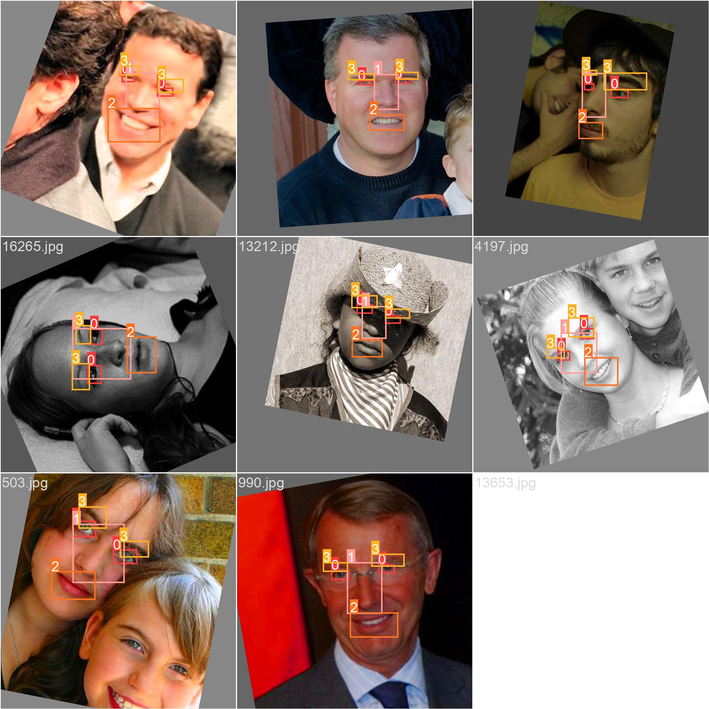
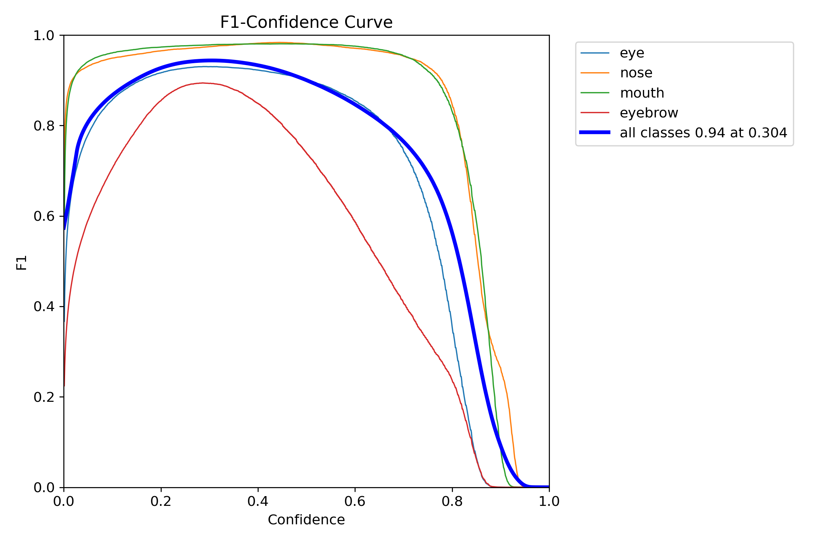

# Face parts detection with YOLOv8 🎯

## Introduction

In this project I use the most recent implementation of YOLO by Ultralytics, [YOLOv8](https://github.com/ultralytics/ultralytics). The goal is to train an algorithm that is able to detect separate face parts without having to use landmark detectors that don't do well when part of the face is occluded or missing. My goal is to also combine frontal, semi-frontal and profile face datasets so that the YOLO model works well on all of them. 

It is also a great opportunity to try out the `supervision` library by [Roboflow](https://github.com/roboflow/supervision). Despite it's still in beta, it looks really helpful for some common YOLO-related tasks such as drawing the detections.

## Data

For this experiment I'm using the following sources:

- Existing datasets: all these datasets were processed by converting each group of facial landmarks (eye, mouth, nose, eyebrows) to a bounding box compatible with YOLO.
  - [Helen dataset](http://www.ifp.illinois.edu/~vuongle2/helen/)
  - [Menpo2D dataset](https://github.com/jiankangdeng/MenpoBenchmark)
  - [AFW (Annotated Faces in the Wild)](https://ibug.doc.ic.ac.uk/resources/facial-point-annotations/)
- Custom datasets:
  - [Pexels](https://pexels.com): I downloaded 85 images from this website and annotated them using [CVAT](https://app.cvat.ai/). I am currently working on another two batches of images.

## Results

### Data quality

Some datasets such as Helen may generate noisy examples when the images have more than one face but only one set of landmarks (i.e. the ones corresponding to the "main" face in the image). This is probably affecting the precision because the model is actually detecting all the faces in these images (which is good, though). Other datasets such as AFW have as many landmarks as faces in the images.

### Performance

The model I've trained (nano) struggles with eyebrows, but it works really well on eyes and noses. I need to add more close-up images of each part to increase the number of incomplete faces.

